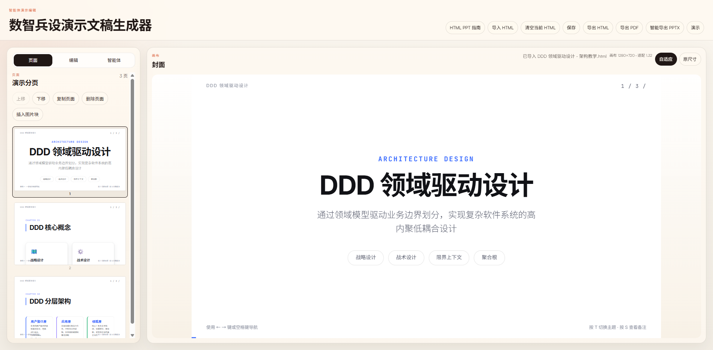
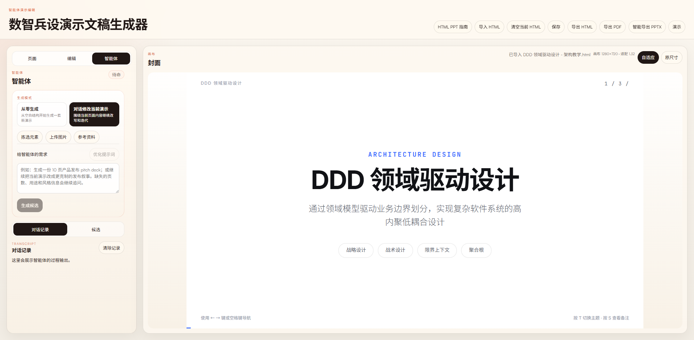
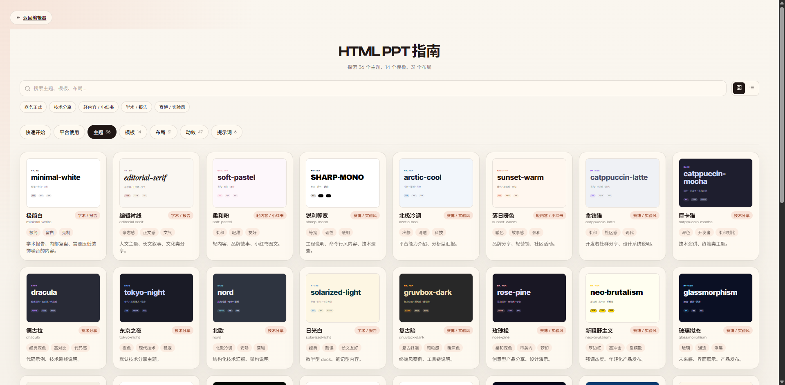
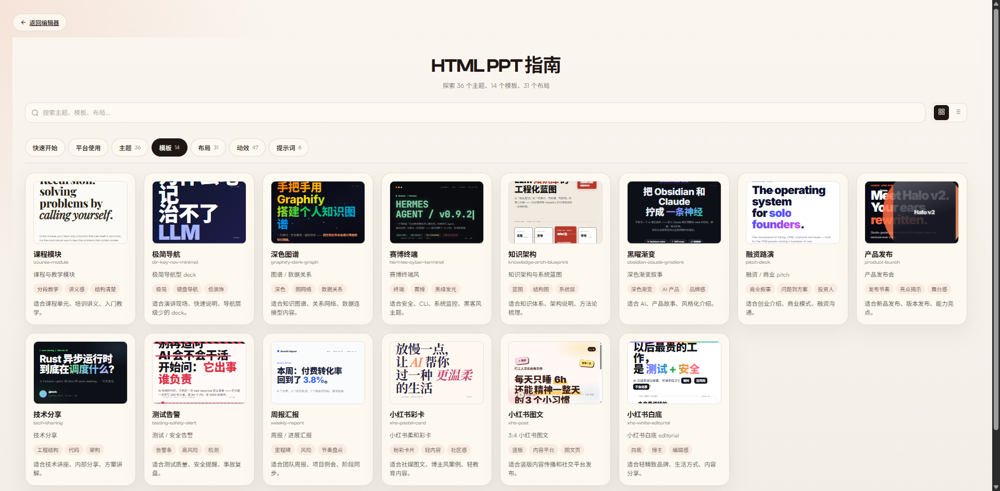
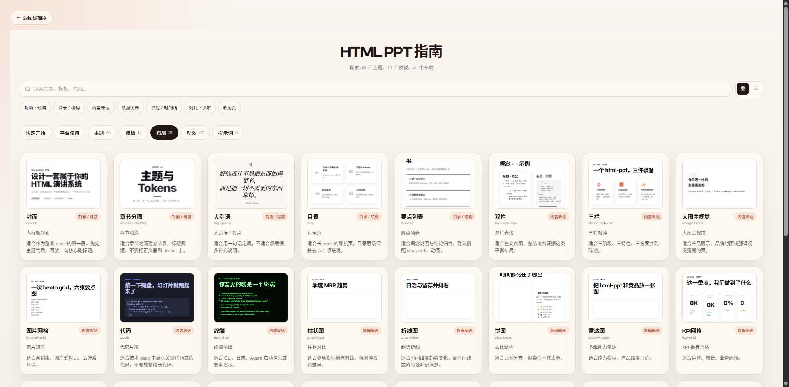
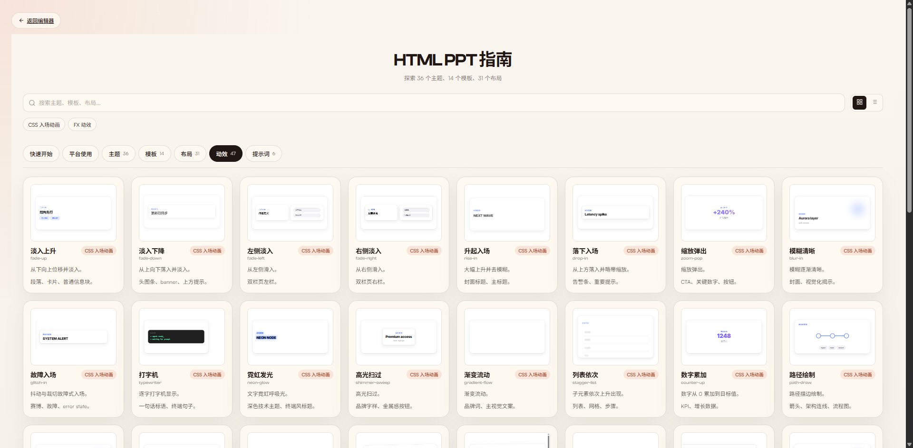

# HTML PPT Editor

HTML PPT Editor is a React and Node.js document generation app for creating, editing, previewing, and exporting HTML-based slide decks. It treats editable deck HTML as the source of truth, provides a visual editor around that contract, and includes an optional AI agent workflow for generating or refining presentations.

HTML PPT Editor 是一个基于 React 和 Node.js 的文稿生成器。项目以可编辑 HTML deck 作为核心数据源，提供可视化编辑、预览、导出，以及可选的 AI Agent 生成工作流。





## Features / 功能

- Edit slide text, images, layout, layers, motion metadata, and deck structure in the browser.
- Import and normalize HTML slide decks through a controlled deck contract.
- Export decks to HTML, PDF, and rasterized PPTX.
- Use the embedded `html-ppt` template and theme bundle for AI-assisted deck generation.
- Browse the HTML PPT guide for themes, templates, layouts, animations, prompt examples, and usage principles.
- Run as a local Vite app during development or as a single Express service in production.

- 在浏览器中编辑文字、图片、布局、图层、动效元数据和页面结构。
- 通过受控 deck contract 导入并规范化 HTML 文稿。
- 支持导出 HTML、PDF 和基于截图栅格化的 PPTX。
- 内置 `html-ppt` 模板与主题资源，可用于 AI 辅助生成文稿。
- 通过 HTML PPT 指南查看主题、模板、布局、动效、提示词示例和使用原则。
- 开发环境使用 Vite，生产环境可作为单体 Express 服务运行。

## HTML PPT Guide / HTML PPT 指南

The guide turns the embedded `html-ppt` resources into a browsable reference, so users can choose a visual direction before generating or editing a deck.

指南会把内置 `html-ppt` 资源整理成可浏览资料库，方便在生成或编辑文稿前先确定视觉方向。

### Themes / 主题

Theme previews help choose the overall tone, including light, dark, editorial, technical, and expressive styles.

主题预览用于选择整体视觉气质，包括浅色、深色、杂志、技术和更具表现力的风格。



### Templates / 模板

Full-deck templates provide complete starting structures for scenarios such as pitch decks, product launches, technical sharing, weekly reports, courses, and Xiaohongshu-style posts.

整套模板提供完整起稿结构，覆盖 pitch deck、产品发布、技术分享、周报、课程和小红书图文等场景。



### Layouts / 布局

Single-page layouts cover common slide patterns such as cover, table of contents, comparison, timeline, KPI grid, code, charts, architecture diagrams, and thank-you pages.

单页布局覆盖封面、目录、对比、时间线、KPI 网格、代码、图表、架构图和结束页等常见页面模式。



### Animations / 动效

Animation previews show the available CSS animations and canvas effects, making it easier to choose restrained motion for presentation and export.

动效预览展示可用的 CSS 动画和 canvas 效果，便于为展示和导出选择克制、合适的运动效果。



## Tech Stack / 技术栈

- React 19, TypeScript, Vite, Vitest
- Express 5 for the local/production API server
- `@anthropic-ai/claude-agent-sdk` for the default Claude Code compatible agent runtime
- `pptxgenjs`, `html-to-image`, `jszip`, and `sharp` for export and document workflows

## Quick Start / 快速开始

```bash
npm install
npm run dev:full
```

Open the Vite URL shown in the terminal. The frontend proxies `/api` to the local server on `127.0.0.1:8787`.

打开终端输出的 Vite 地址即可使用。本地开发时，前端会把 `/api` 请求代理到 `127.0.0.1:8787` 的后端服务。

You can also run the frontend and backend separately:

也可以分别启动前后端：

```bash
npm run dev
npm run dev:server
```

## Environment / 环境变量

Copy the example file before running production or AI workflows:

生产部署或启用 AI 工作流前，先复制示例环境文件：

```bash
cp .env.production.example .env.production
```

Never commit real `.env` files. Put API keys, invite codes, cookie secrets, Redis URLs, and runtime storage paths in `.env.production` or in your deployment platform's secret manager.

不要提交真实 `.env` 文件。API key、邀请码、cookie secret、Redis URL 和运行时存储路径应写入本地 `.env.production`，或部署平台的 secret 配置。

Important variables:

关键变量：

- `PORT`: backend server port, defaults to `8787`.
- `PPT_INVITE_CODE`: invite code required to enter the app.
- `PPT_INVITE_COOKIE_SECRET`: long random secret used to sign invite sessions.
- `PPT_SANDBOX_ROOT`, `PPT_ARTIFACT_ROOT`, `PPT_UPLOAD_ROOT`: writable runtime directories.
- `REDIS_URL`: optional shared session store for multi-instance deployments.
- `ANTHROPIC_BASE_URL`, `ANTHROPIC_AUTH_TOKEN`, `ANTHROPIC_MODEL`: Claude Code compatible agent provider settings.

## Scripts / 常用命令

```bash
npm run dev          # Start the Vite frontend
npm run dev:server   # Start the Express API server
npm run dev:full     # Start frontend and backend together
npm run build        # Type-check and build the frontend bundle
npm run preview      # Preview the production frontend bundle
npm run start        # Start the production server
npm test             # Run Vitest once
npm run test:watch   # Run Vitest in watch mode
```

## Project Structure / 项目结构

```text
image/              README screenshots
src/app/            React editor UI and routes
src/app/editor/     Focused editor helpers and controls
src/deck-contract/  Editable HTML deck parsing, patching, and serialization
src/export-*/       HTML, PDF, and PPTX export pipelines
src/agent/          Shared frontend/backend agent protocol types
server/             Express API server and agent orchestration
public/             Static assets served by Vite
docs/               Deployment and architecture notes
```

## Deployment / 部署

For a production build:

生产构建：

```bash
npm ci
npm run build
npm start
```

The Express server serves `dist/` when it exists and handles all `/api/*` routes. Do not deploy `dist/` as a standalone static site if you need invite gating, uploads, sessions, or AI generation.

当 `dist/` 存在时，Express 会同时提供前端页面和 `/api/*` 接口。如果需要邀请码门禁、上传、会话或 AI 生成功能，不要只把 `dist/` 当静态站点部署。

More deployment notes are available in `docs/deployment.md` and `docs/container-deployment.md`.

更多部署说明见 `docs/deployment.md` 和 `docs/container-deployment.md`。

## Repository Hygiene / 仓库安全

The repository ignores local runtime state and private configuration such as `.env*`, `.runtime/`, `.claude/`, `.superpowers/`, `.playwright-mcp/`, `outputs/`, build output, coverage, logs, and debug artifacts.

仓库已忽略本地运行状态和私有配置，例如 `.env*`、`.runtime/`、`.claude/`、`.superpowers/`、`.playwright-mcp/`、`outputs/`、构建产物、覆盖率、日志和调试文件。

Before publishing a fork or mirror, run:

发布 fork 或镜像前建议运行：

```bash
git status --short
git check-ignore -v .env.production .runtime/foo .superpowers/foo outputs/foo .claude/foo
```

## Contributing / 贡献

Keep behavior changes focused and add regression tests for deck editing, serialization, preview layout, agent protocol, or export changes. Use `npm test` and `npm run build` before opening a pull request.

请保持改动聚焦。涉及 deck 编辑、序列化、预览布局、agent 协议或导出行为时，请补充回归测试。提交 PR 前运行 `npm test` 和 `npm run build`。

## License / 许可证

MIT
